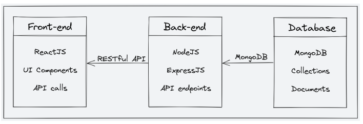

# EduVerse E-Learning Platform (MERN App) 

## Project Description

**EduVerse** is a fully functional ed-tech platform that enables users to create, consume, and rate educational content. The platform is built using the MERN stack, which includes ReactJS, NodeJS, MongoDB, and ExpressJS.

EduVerse aims to provide:

* A seamless and interactive learning experience for students, making education more accessible and engaging.
* A platform for instructors to showcase their expertise and connect with learners across the globe.

In the following sections, we will cover the technical details of the platform, including:

1. System architecture
2. Front-end
3. Back-end
4. API Design
5. Deployment
6. Testing
7. Future Enhancements

In summary, **EduVerse** is a versatile and intuitive ed-tech platform designed to provide an immersive learning experience to students and a platform for instructors to showcase their expertise.

## System Architecture

The **EduVerse** ed-tech platform consists of three main components: the front end, the back end, and the database. The platform follows a client-server architecture.

### Front-end

Built using ReactJS, the front end allows for the creation of dynamic and responsive user interfaces. It communicates with the back end using RESTful API calls.

### Back-end

Built using NodeJS and ExpressJS, the back end provides APIs for user authentication, course creation, and course consumption, and handles course content and user data.

### Database

MongoDB is used as the NoSQL database to store course content, user data, and other related information.

### Architecture Diagram

Here is a high-level diagram that illustrates the architecture of the **EduVerse** ed-tech platform:

## Front End

The front end of **EduVerse** includes essential pages for an ed-tech platform:

### For Students:

* Homepage
* Course List
* Wishlist
* Cart Checkout
* Course Content
* User Details
* User Edit Details

### For Instructors:

* Dashboard
* Insights
* Course Management Pages
* View and Edit Profile Details

### For Admin (future scope):

* Dashboard
* Insights
* Instructor Management
* Other Relevant Pages

Technologies used: ReactJS, CSS, Tailwind CSS, Redux (for state management)

## Back End

**EduVerse** uses a monolithic backend architecture built with Node.js, Express.js, and MongoDB.

### Features:

1. User authentication and authorization (including OTP and password recovery)
2. Course management (CRUD for instructors and ratings for students)
3. Payment integration with Razorpay
4. Cloudinary for media storage
5. Markdown for course content

### Technologies:

* Node.js
* MongoDB
* Express.js
* JWT
* Bcrypt
* Mongoose

### Data Models:

* Student schema
* Instructor schema
* Course schema

The back-end is focused on scalability, security, and performance.

## API Design

The **EduVerse** platform's API follows REST architecture, uses JSON for data exchange, and includes the following endpoints:

### Sample Endpoints:

1. `POST /api/auth/signup`
2. `POST /api/auth/login`
3. `POST /api/auth/verify-otp`
4. `POST /api/auth/forgot-password`
5. `GET /api/courses`
6. `GET /api/courses/:id`
7. `POST /api/courses`
8. `PUT /api/courses/:id`
9. `DELETE /api/courses/:id`
10. `POST /api/courses/:id/rate`

### Example Requests:

* `GET /api/courses` – Returns a list of all courses
* `GET /api/courses/:id` – Returns a specific course
* `POST /api/courses` – Adds a new course
* `PUT /api/courses/:id` – Updates a course
* `DELETE /api/courses/:id` – Deletes a course

The RESTful API ensures reliable, maintainable communication between the front and back ends.

